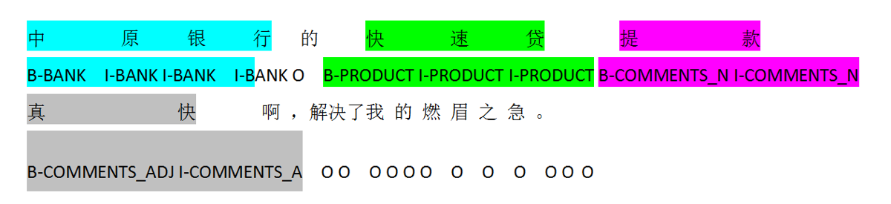

# 银行产品评论观点提取
**南京大学计算机科学与技术系研究生选修课程《自然语言处理》（2021秋）课程项目作业**

本项目采用PaddlePaddle+ERNIE进行实现。

本项目可在[百度AI Studio平台](https://aistudio.baidu.com/aistudio/projectdetail/3281489)在线运行和调试（需要使用GPU环境）。项目源码已上传[Github](https://github.com/MilesPoupart/nju-nlp-project-2021)。

项目数据集已包含在本项目`/data/data122751`路径中，具体数据集说明和下载见[数据集详情页面](https://aistudio.baidu.com/aistudio/datasetdetail/122751)。

本项目的代码主要参考了[这一博文](https://blog.csdn.net/weixin_41611054/article/details/118487666)（[GitHub项目地址](https://github.com/zhenhao-huang/paddlehub_ernie_emotion_analysis)），特表示感谢！

## 文件说明
main.ipynb包含所有任务的源码和详细说明。to_csv.py是数据集划分预处理程序源码，finetune_ernie-classify.py和finetune_ernie-ner.py是分类任务和NER任务的加载数据和训练保存模型的代码，predict-classify.py和predict-ner.py是预测程序的源码。

## 项目要求
现有有关银行及银行相关产品的若干条中文评论，要求对这些评论进行观点提取。具体而言，分为以下两个子任务：

### 实体识别
要求识别出原始评论文本中的实体及类型，并按BIO格式进行标注。 需要进行识别的实体有：银行、产品、用户评论中的名词及形容词，具体的标注标签及说明如下表所示：

|标签|说明|
|:----:|:----:|
|B-BANK|代表银行实体的开始|
|I-BANK|代表银行实体的内部|
|B-PRODUCT|代表产品实体的开始|
|I-PRODUCT|代表产品实体的内部|
|B-COMMENTS_N|代表用户评论（名词）|
|I-COMMENTS_N|代表用户评论（名词）实体的内部|
|B-COMMENTS_ADJ|代表用户评论（形容词）|
|I-COMMENTS_ADJ|代表用户评论（形容词）实体的内部|
|O|代表不属于标注的范围|

下图是一个标注的例子：

### 情感分类
根据用户评论的文本内容，判断其情感极性，并对其情感进行分类。 本次实验任务中，需要将用户的评论划分为正面（1）、负面（0）和中立（2）三种类型。

## 数据集文件介绍
包含两个文件：用于训练和验证的train.csv以及用于测试提交并测评的test.csv

### 数据格式
#### train.csv
|字段名|字段说明|
|:-----:|:-----:|
|text|评论原始文本 |
|BIO_anno|BIO格式的实体标注|
|class|情感分类(1:正面,0:负面,2:中立) |

#### test.csv
|字段名|字段说明|
|:-----:|:-----:|
|id|文本id|
|text|评论文本|

### 特别说明
本数据集已经对课程提供的原始数据集中部分内容进行了调整和修正，包括：

+ 替换评论文本中的换行符为空格

    涉及的数据为：
    |在原始数据集中的行号（标题为第1行）|text|调整后的text|
    |:----:|:----|:----|
    |4823|多币账户看起来多而已，实际上征信只算一条好么…只要不逾期没有什么影响 而且态度坚决一点 都可以直接销的 大妈行没这么墨迹|多币账户看起来多而已，实际上征信只算一条好么…只要不逾期没有什么影响 而且态度坚决一点 都可以直接销的 大妈行没这么墨迹|

+ 纠正token与label数目不匹配问题

    涉及的数据为：
    |在原始数据集中的行号（标题为第1行）|text|label| token数目|标签数目|调整后的label|
    |:----:|:----|:----|:----:|:----:|:----|
    745|楼主，解决了吗？我的跟你一样，好操心|O O O O O O O O O O O O O O O O B-COMMENTS_ADJ I-COMMENTS_ADJ O |18|19|O O O O O O O O O O O O O O O O B-COMMENTS_ADJ I-COMMENTS_ADJ|
    1841|中行_7.4k|B-BANK I-BANK O O O O O O|7|8|B-BANK I-BANK O O O O O|
    1856|招行_经典白100k|B-BANK I-BANK O B-PRODUCT I-PRODUCT I-PRODUCT O O O O O|10|11|B-BANK I-BANK O B-PRODUCT I-PRODUCT I-PRODUCT O O O O|
    4593|中信好久不能调额了|B-BANK I-BANK B-COMMENTS_ADJ I-COMMENTS_ADJ B-COMMENTS_ADJ I-COMMENTS_ADJ O O O O O O O O O O O|9|17|B-BANK I-BANK B-COMMENTS_ADJ I-COMMENTS_ADJ B-COMMENTS_ADJ I-COMMENTS_ADJ O O O|
